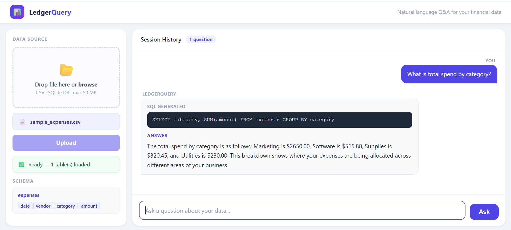

# LedgerQuery

**Natural language Q&A for small business financial data — powered by Text2SQL and LLM-generated answers.**

A small business owner shouldn't need to know SQL to ask "What did I spend on marketing last quarter?" LedgerQuery takes a plain English question, generates a validated SQL query, runs it against the real database, and returns a natural language answer — with the generated SQL shown transparently so you can verify every answer.



---

## Why Text2SQL Instead of Traditional RAG

Standard RAG (chunk → embed → retrieve → answer) breaks on structured tabular data in three fundamental ways:

- **No aggregation** — vector search retrieves rows by similarity, not by computation. It cannot sum, average, or group.
- **No completeness guarantee** — top-k retrieval misses rows that are relevant but not semantically close to the query.
- **Non-deterministic** — the same question can retrieve different chunks on different runs, producing inconsistent answers.

Text2SQL replaces chunk retrieval with LLM-generated SQL executed directly against the database. The result is always computed from the full dataset, always deterministic, and always verifiable.

---

## Pipeline Architecture

```
User Query
    │
    ▼
Schema Retrieval      ← reads sqlite_master + PRAGMA table_info()
    │
    ▼
Prompt Construction   ← injects schema + rules into system message
    │
    ▼
SQL Generation        ← llama-3.3-70b-versatile via Groq API
    │
    ▼
Validation Gate       ← sqlglot syntax check + table/column existence check
    │         │
  valid     invalid
    │         │
    │         ▼
    │     Retry Loop  ← feeds error back to LLM (max 3 attempts)
    │
    ▼
Read-Only Execution   ← SQLite URI mode=ro enforced at connection level
    │
    ▼
Answer Generation     ← second LLM call: result → plain English
    │
    ▼
Session History       ← SQL + answer appended to running Q&A history
```

---

## Validation Layers

Three independent defenses prevent bad queries from reaching the database:

**1. Syntax validation** — `sqlglot.parse_one()` catches unparseable SQL before execution.

**2. Schema validation** — every table and column referenced in the generated query is checked against the real schema metadata. Any hallucinated table or column name is rejected immediately.

**3. Read-only enforcement** — the database connection is opened with `sqlite3.connect("file:db?mode=ro", uri=True)`. INSERT, UPDATE, DELETE, and DROP statements are blocked at the connection level, not just by keyword filtering.

Failed queries are fed back to the LLM with the specific error message for self-correction, up to 3 retry attempts.

---

## Bugs Found and Fixed During Testing

Two silent wrong-answer bugs were caught through test-driven development:

**Case-sensitivity mismatch** — `WHERE category = 'marketing'` returned no results because the stored value was `'Marketing'`. Fixed by adding a prompt rule requiring `LOWER(column) = LOWER('value')` for all text comparisons, so casing in the question never affects results.

**Date-range pattern matching** — `LIKE '2025-0%'` matched April (month 04) in addition to Q1 months (01, 02, 03), returning an inflated row count. Fixed by requiring proper date comparison operators (`>=`, `<`, `BETWEEN`) instead of LIKE on date strings.

Both fixes live in the system prompt, not in post-processing, so they apply to every query the LLM generates.

---

## Features

- Upload a CSV or SQLite `.db` file — schema is extracted automatically
- Ask questions in plain English; get SQL + natural language answer
- Session-based Q&A: ask multiple questions in one session, compare answers
- Transparent SQL display — every answer shows the exact query that produced it
- Retry loop with error feedback — LLM self-corrects on validation failures
- Read-only database enforcement — no data can be modified through the interface
- Two interfaces: Gradio standalone UI and FastAPI + custom HTML/CSS UI
- 9 pytest tests covering the full pipeline

---

## Tech Stack

| Layer | Tool |
|---|---|
| LLM | Groq API — `llama-3.3-70b-versatile` |
| SQL Validation | sqlglot |
| Database | SQLite (via Python `sqlite3`) |
| Data Ingestion | pandas |
| API Backend | FastAPI |
| Gradio UI | Gradio |
| Custom UI | Vanilla HTML / CSS / JS |
| Testing | pytest |

---

## Project Structure

```
week6-ledgerQuery/
├── data/
│   └── sample_expenses.csv     # 15-row synthetic dataset for testing
├── tests/
│   └── test_pipeline.py        # 9 pytest tests
├── demo.png                    # UI screenshot
├── .env                        # GROQ_API_KEY (not committed)
├── .gitignore
├── app.py                      # Gradio UI
├── fastapi_backend.py          # FastAPI backend + serves index.html
├── index.html                  # Custom HTML/CSS/JS frontend
├── ledger_pipeline.py          # Core pipeline (all functions)
├── conftest.py
└── requirements.txt
```

---

## Setup

**1. Clone and install dependencies**

```bash
git clone https://github.com/mohitkrishna21/ledgerquery
cd ledgerquery
pip install -r requirements.txt
```

**2. Add your Groq API key**

Create a `.env` file in the project root:

```
GROQ_API_KEY=your_key_here
```

Get a free key at [console.groq.com](https://console.groq.com).

---

## Running the App

**Option A — Gradio UI (standalone)**

```bash
python app.py
```

Opens at `http://localhost:7860`

**Option B — FastAPI + Custom HTML UI**

```bash
python -m uvicorn fastapi_backend:app --reload
```

Opens at `http://localhost:8000`

---

## Running Tests

```bash
python -m pytest tests/ -v
```

All 9 tests should pass. The test suite covers CSV ingestion, schema extraction, schema formatting, SQL validation (valid query, invalid table, invalid column, syntax error), SQL execution, and read-only enforcement.

---

## Sample Questions

These work out of the box with `data/sample_expenses.csv`:

- What is total spend by category?
- Which vendor did I spend the most with?
- How much did I spend in Q1 2025?
- What was my total spend in January?
- List all marketing expenses

---

## Known Limitations

**Server state persists until restart** — the loaded database is stored in server memory. Refreshing the browser does not reset state; restart the FastAPI process to start fresh.

**sqlglot parser leniency** — the validation layer uses sqlglot's AST parser, which is more permissive than SQLite's actual grammar in some edge cases. The execution layer acts as a final safety net, since SQLite itself will reject any query the parser misses.

**Ambiguity not always detected** — questions like "Who is my best customer?" require defining what "best" means. The LLM includes a `CANNOT_ANSWER` fallback for clearly unanswerable questions, but ambiguous cases may produce a plausible-looking query that answers one interpretation without flagging the ambiguity.

**Single-table queries only** — the current pipeline is scoped to single-table SQLite databases. Multi-table JOINs and Postgres/MySQL support are planned.

---

## Future Work

- Multi-table JOIN support with foreign key-aware schema injection
- PostgreSQL and MySQL connectors
- Logging: retry count, latency, and validation failure reasons per query
- AWS EC2 deployment with Docker for persistent hosting
- Synthetic large-scale dataset (50k–100k rows) for scale testing

---

## License

MIT
